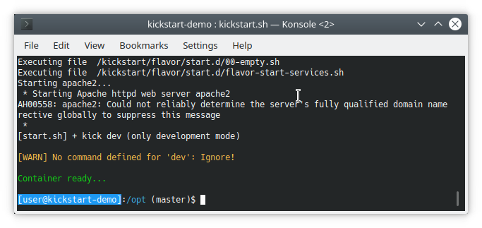

# Container-based Software Development Kits

By using *containers* not only for deployment but *also for development*, there is no need
to install libraries on your workstation. Nor do you have to care about version
conflicts, environments, paths, etc.

No more buggy project setup documentation. <kbd>git clone</kbd> the project and run <kbd>kickstart</kbd>.
Everything else is done 


## Clone and start our example project

Change to your Projects-directory <kbd>cd ~/Projects</kbd> and clone infracamp's demo project: 
<kbd>git clone https://github.com/infracamp/kickstart-demo.git</kbd>. Change to the demo project directory
<kbd>cd kickstart-demo</kbd> and run <kbd>kickstart</kbd>.

After the container was downloaded and startet, you'll see the bash prompt inside the container. You
can use `git`, `ssh`, `bash history` like you do in your local shell. The project-directory is mounted
to `/opt` inside the container:



Open `http://localhost:4300` in your browser. 

What happened?

- <kbd>kickstart.sh</kbd> evaluated the container configuration file <kbd>.kick.yml</kbd>
  and runs the container `infracamp/kickstart-flavor-gaia` specified in the `from` section.
  The container is running in **development-mode**: debugger, and other developer stuff is enabled.
  
- The current project directory is mounted to `/opt` directory inside the container and
  user rights are adjusted to your local user rights. Environment variables are adjusted.
  
- Inside the container, the starter script <kbd>kick</kbd> evaluates `.kick.yml` and runs the
  commands to install required stuff and setup the container. 
  
- To exit the container just type <kbd>exit</kbd>.


## Run additional services in stack

To run additional services in development environment, just create a docker-compose like stack
file named `.kick-stack.yml` in your projects root directory.

<kbd>kickstart</kbd> will automatically create a new network with
the name of your current project. Make sure to adjust the names
in your stack file:


***`.kick-stack.yml`***
```yaml
version: "3"
services:
  # This service will be available as: project_name_some_service
  some_service:
    image: some/image
    networks:
      - project_name  ## <- Adjust these to your projects name

networks:
  project_name: ## <- Adjust these to your projects name
    external: true
```


## Start your own project

