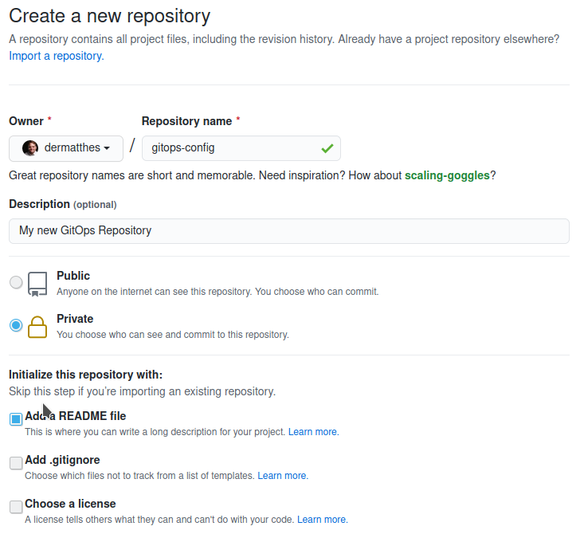
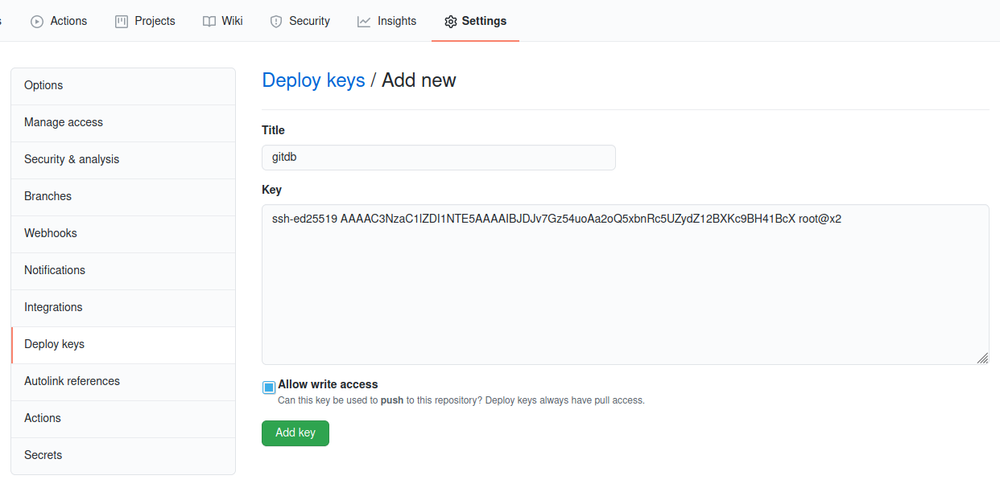
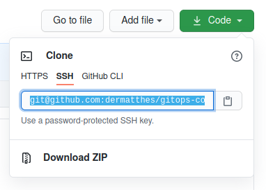
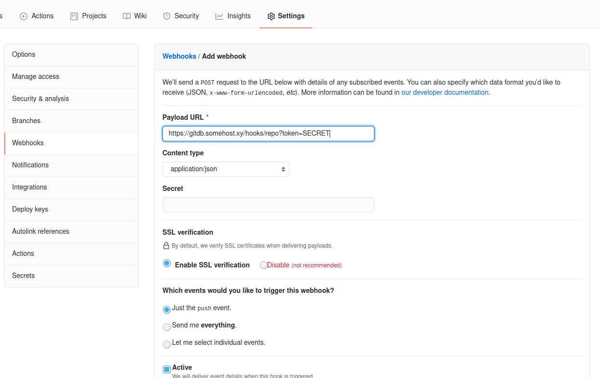

## Setting up the Master Node

To get Rudl up and running, you have to setup the manager cluster
your own. Afterwards, cluster setup will be only one line. But let's start:
  
***Prepare the server***
```bash
sudo apt-get -y install curl pwgen docker.io whois
sudo gpasswd -a $USER docker
<logout and login again>
docker swarm init
```

If using Ubuntu, don't use snap version of docker installed during boot time.


***Create and register secrets***
```bash
ssh-keygen -f rudldb_ssh_key -t ed25519 -q -N ""
pwgen -s 128 1 > rudldb_vault_secret
pwgen -s 64 1 > ingress1_client_secret
pwgen -s 64 1 > issuer1_client_secret
pwgen -s 64 1 > swarm1_client_secret

cat rudldb_vault_secret | docker secret create rudldb_vault_secret -
cat rudldb_ssh_key | docker secret create rudldb_ssh_key -
cat ingress1_client_secret | docker secret create ingress1_client_secret -
cat issuer1_client_secret | docker secret create issuer1_client_secret -
cat swarm1_client_secret | docker secret create swarm1_client_secret -

curl -o rudl-master-stack.yml https://raw.githubusercontent.com/rudl-project/rudl.infracamp.org/main/docs/setup/master/rudl-master-stack.yml
```

***Create an empty repository***

Create an empty private repository on gitlab, github, bitbucket or your
own git server. Specify to **create a Readme** (so it will create a main or master
branch as well):



Export your public ssh key:
```
cat rudldb_ssh_key.pub
```

and add it as as deploy key **including write privileges**:



***Copy the ssh clone url***

Copy the **ssh clone url** of your newly created gitops repository



***Open an editor and edit the already downloaded `rudl-master-stack.yml`***

```
nano rudl-master-stack.yml
```

Find the part `GIT_REPO_URL: git@PUT_YOUR_GIT_SSH_CLONE/URL/HERE.git` and replace it
with your **ssh clone url**.


## Start the cluster

Now it's time to start your initial setup and take a first test.

```
docker stack deploy -c rudl-master-stack.yml rudl
```


## Did it work?

Check the service status

```
docker service ps rudl_gitdb
docker service logs rudl_gitdb
```

## GitDb Configuration

**We assume you do the following steps on your workstation**

Now it's time to clone your repository locally and configure the 
clients. Download the gitdb.yml

Create a new gitdb.conf.yml in the projects root directory:
```
curl -o gitdb.conf.yml https://raw.githubusercontent.com/rudl-project/rudl.infracamp.org/main/docs/setup/master/gitdb.conf.yml
```

And insert the hash Values into clients:

```
cat ingress1_client_secret | mkpasswd -m sha-512 -s
```

Copy the output and put it in '<put in: ingress1_client_secret hash>' of gitdb.conf.yml. Then
Commit and push the changes.

```
git commit -am "gitdb adjustments for startup"
```


## Configure the Issuer service


```
cat issuer1_client_secret | mkpasswd -m sha-512 -s
```


## Configure swarm agent service

```
cat swarm1_client_secret | mkpasswd -m sha-512 -s
```


## Configure the repository hook

On your gitops repository, add `https://gitdb.yourdomain.xy/hooks/repo?token=XYZ` as 
trigger url:



## Test your configuration

Now push 

## Trigger update after CI/CD builds

Rudl is build to deploy changed containers. Therefor any project
can call `/hooks/trigger?token=xyz` which will trigger a update.


## Make it self containing

If you want - and it's recommended - you can manage the rudl master
cluster with rudl as well. To do so, copy your manually created master-rudl-stack.yml
to your gitops repository and define it as stack.

